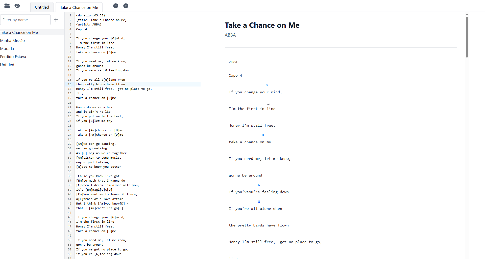

# 🎶 Chord Sheets View App

A cross-platform application for managing, editing, and viewing chord sheets.
Built to help musicians organize their songs with **ChordPro support**, an intuitive interface, and real-time chord transposition.

---



## 🚀 Features

* 📂 Import and manage song files (`.cho`, `.chopro`, `.pro`)
* ✍️ Edit and format chord sheets with live preview
* 🎸 Easy chord transposition
* 🔍 Quick search and filtering of songs
* 🖥️ Cross-platform support (Windows, macOS, Linux – planned mobile versions for Android & iOS)
* 🎵 Tab-like navigation for multiple open songs

---

## 🛠️ Tech Stack

* **Frontend:** React + TypeScript
* **Styling:** Tailwind CSS
* **State Management:** Zustand
* **Packaging:** Electron (desktop builds)

---

## 📦 Installation

```bash
# Clone repository
git clone https://github.com/bruno-langer/chordpro-app.git
cd chords-app

# Install dependencies
npm install

# Run development mode
npm run dev

# Build for production
npm run build
```

---

## 📖 Usage

1. Launch the app.
2. Import your `.cho` or `.chopro` files.
3. Open songs in tabs and switch easily between them.
4. Use the transposition feature to adjust chords to your key.

---

## 🗺️ Roadmap

- [ ] Mobile apps (iOS/Android)
- [ ] Integration with setlist sharing
- [ ] Cloud sync for song collections

---

## 🤝 Contributing

Contributions are welcome!

1. Fork the repo
2. Create your feature branch (`git checkout -b feature/new-feature`)
3. Commit changes (`git commit -m 'Add new feature'`)
4. Push branch (`git push origin feature/new-feature`)
5. Open a Pull Request

---

## 📄 License

This project is licensed under the **MIT License** – see the [LICENSE](LICENSE) file for details.

---
