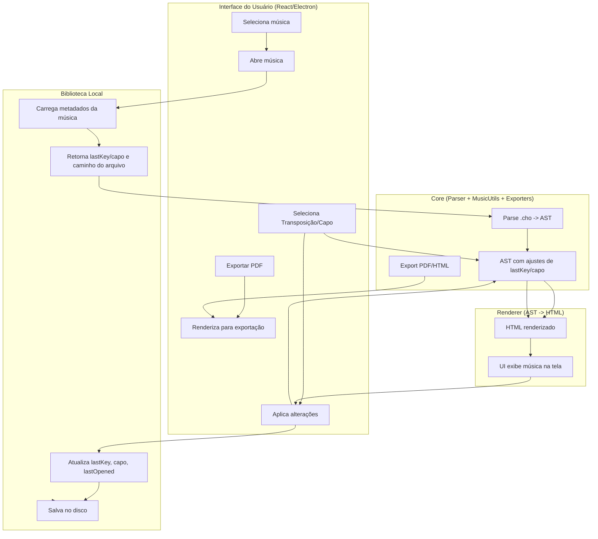

# Projeto MVP de Cifras Multiplataforma

## 🔹 Visão Geral
Este projeto tem como objetivo criar um **MVP de gerenciamento de cifras musicais** com suporte a arquivos `.cho` (ChordPro), renderização em HTML, transposição de acordes, capotraste, biblioteca local e exportações. A arquitetura proposta permite futura expansão para nuvem, colaboração e integração com softwares de palco.

O MVP será multiplataforma:
- **Desktop:** Electron + React
- **Mobile:** React Native (futuro)
- **Web:** Next.js ou Vite + React (futuro)

---

## 🔹 Funcionalidades do MVP

1. **Abrir arquivos `.cho`**
   - Parser transforma o conteúdo em **AST (Abstract Syntax Tree)**.
   - Renderer converte AST em HTML responsivo.

2. **Transposição de tom**
   - Ajuste manual pelo usuário (+/- semitons).
   - Core aplica alterações na AST.

3. **Capotraste**
   - Usuário define a posição do capo.
   - Core recalcula acordes automaticamente.

4. **Exportações**
   - PDF (para impressão)
   - HTML offline
   - Markdown (para compartilhamento futuro)

5. **Biblioteca Local**
   - Armazena metadados da música:
     - Título, artista, caminho `.cho`
     - Último tom (`lastKey`) e capo
     - Tags/pastas
     - Data da última abertura
   - Facilita abrir música no **último tom/capo usado**.
   - Armazenamento: JSON local ou SQLite (desktop), AsyncStorage ou SQLite (mobile).

6. **Modo Performance**
   - Tela cheia com letras grandes
   - Scroll automático configurável
   - Troca rápida de músicas no setlist

---

## 🔹 Core Concepts

### 1. Parser
- Lê arquivos `.cho` (ChordPro 6.07)
- Gera **AST** com:
  - Títulos, seções (verso, refrão, ponte)
  - Acordes e letras
  - Anotações e metadados

### 2. MusicUtils
- Funções para:
  - Transposição
  - Capotraste
  - Manipulação de acordes

### 3. Renderer
- Recebe AST do Core
- Gera HTML responsivo
- Serve para:
  - Visualização na UI
  - Exportações PDF/HTML/Markdown

### 4. Biblioteca Local
- Classe `SongLibrary` gerencia metadados:
```ts
type SongMeta = {
  id: string;
  title: string;
  artist?: string;
  path: string;
  lastKey: number;
  capo: number;
  tags?: string[];
  lastOpened: string;
};
````

* Suporta:

  * `addSong()`
  * `getSong()`
  * `updateSong()`
  * `listSongs()`
  * `saveToDisk()` / `loadFromDisk()`

---

## 🔹 Workflows Principais

### Abrir Música

1. UI solicita música
2. Biblioteca retorna metadados (`lastKey`, capo) e caminho `.cho`
3. Core faz parse → AST
4. AST ajustado com tom/capo
5. Renderer gera HTML
6. UI exibe música

### Transposição / Capotraste

1. Usuário altera tom ou capo
2. Core recalcula AST
3. Renderer gera novo HTML
4. UI atualiza visual
5. Biblioteca atualiza metadados (`lastKey`, capo, lastOpened)

### Exportar

1. UI solicita exportação
2. Renderer gera HTML
3. Core converte para PDF ou Markdown
4. Arquivo final é salvo

### Diagrama de Fluxo (Mermaid)



---

## 🔹 Estrutura de Pastas Recomendada (Vite + Electron)

```
my-app/
├─ node_modules/
├─ public/
│  ├─ icons/
│  ├─ fonts/
│  └─ images/
├─ src/
│  ├─ main.ts           # Electron main process
│  ├─ preload.ts        # Exposição segura do Core
│  ├─ renderer.tsx      # Entrada React
│  ├─ core/
│  │  ├─ parser.ts
│  │  ├─ renderer.ts
│  │  ├─ musicUtils.ts
│  │  ├─ exporters.ts
│  │  ├─ types.ts
│  │  └─ library.ts
│  ├─ renderer/
│  │  ├─ App.tsx
│  │  ├─ pages/
│  │  │  ├─ LibraryPage.tsx
│  │  │  ├─ SongPage.tsx
│  │  │  └─ SettingsPage.tsx
│  │  ├─ components/
│  │  │  ├─ SongList.tsx
│  │  │  ├─ SongItem.tsx
│  │  │  ├─ ChordLine.tsx
│  │  │  └─ PlayerControls.tsx
│  │  ├─ styles/
│  │  │  ├─ globals.css
│  │  │  └─ Song.css
│  │  └─ hooks/
│  │      └─ useLibrary.ts
├─ tests/
│  ├─ fixtures/
│  │  ├─ twinkle.cho
│  │  └─ happy.cho
│  └─ core.test.ts
├─ package.json
├─ vite.config.ts
├─ tsconfig.json
└─ index.html
```

---

## 🔹 Scripts sugeridos (package.json)

```json
{
  "scripts": {
    "dev": "vite",
    "build": "vite build",
    "electron:dev": "concurrently \"vite\" \"electron .\"",
    "electron:build": "electron-builder"
  }
}
```

---

## 🔹 Observações importantes

* **Core** é a fonte da verdade (AST + MusicUtils).
* **Renderer** converte AST em HTML ou PDF, nunca altera AST.
* **UI** controla a navegação, inputs do usuário e comunicação com Core via **IPC**.
* **Biblioteca local** mantém preferências do usuário, permitindo abrir cada música no último tom/capo usado.
* Arquitetura modular facilita:

  * Exportações futuras (Markdown, PowerPoint, ProPresenter)
  * Integrações com nuvem
  * Colaboração entre usuários
  * Aplicações mobile/web

---